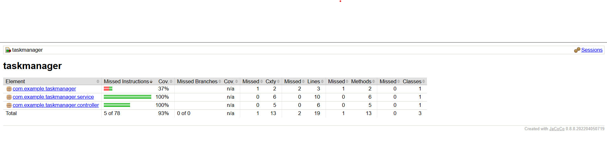

# Task Manager API

A Spring Boot REST API for managing tasks with full CRUD operations.

---

## APIs Created and Their Functionality

| HTTP Method | Endpoint           | Description                        |
|-------------|--------------------|----------------------------------|
| GET         | `/api/tasks`       | Retrieve all tasks                |
| POST        | `/api/tasks`       | Create a new task                 |
| PUT         | `/api/tasks/{id}`  | Update an existing task by ID    |
| DELETE      | `/api/tasks/{id}`  | Delete a task by ID               |

---

## Database Used and Integration

- **Database:** MySQL
- **Database Name:** `taskdb`
- **Integration:** 
  - Used **Spring Data JPA** to interact with MySQL.
  - The entity class `Task` is mapped to a database table.
  - Database connection configured in `application.properties` with JDBC URL, username, and password.
  - Hibernate automatically manages schema updates with `spring.jpa.hibernate.ddl-auto=update`.

---

## How to Run the Server Locally

### Prerequisites
- Java 21 or above installed
- Maven installed
- MySQL server running

### Steps
1. Create the database (if not already done):

   ```sql
   CREATE DATABASE taskdb;
   ```

2. Configure your MySQL credentials in `src/main/resources/application.properties`:

   ```properties
   spring.datasource.url=jdbc:mysql://localhost:3306/taskdb
   spring.datasource.username=root
   spring.datasource.password=system
   spring.jpa.hibernate.ddl-auto=update
   ```

3. Build and run the Spring Boot app:

   ```bash
   ./mvnw spring-boot:run
   ```

4. Server will start on: `http://localhost:9091` (or the configured port)

---

## How to Interact with the API

You can use tools like **Postman**, **curl**, or any HTTP client.

### Sample Requests:

* **Create a Task** (POST `/api/tasks`)

  ```json
  {
    "title": "Finish API Server",
    "description": "Build and test Spring Boot API project",
    "completed": false
  }
  ```

* **Get All Tasks** (GET `/api/tasks`)

  Response:

  ```json
  [
    {
      "id": 1,
      "title": "Finish API Server",
      "description": "Build and test Spring Boot API project",
      "completed": false
    }
  ]
  ```

* **Update a Task** (PUT `/api/tasks/{id}`)

  ```json
  {
    "title": "Finish API Server - Updated",
    "description": "Updated project backend",
    "completed": true
  }
  ```

* **Delete a Task** (DELETE `/api/tasks/{id}`)

## 🧪 Testing Information

### 🔧 Tech Stack Used for Testing

* **JUnit 5** – For writing unit and integration tests
* **Mockito** – For mocking dependencies
* **MockMvc** – For simulating HTTP requests in API tests
* **JaCoCo** – For generating code coverage reports

### 🚀 How to Run Tests

To run all tests and generate the code coverage report:

```bash
./mvnw clean test
```

or on Windows:

```bash
mvnw.cmd clean test
```

> 📂 After running, the coverage report can be found at:

```
target/site/jacoco/index.html
```

### 🖼️ Test Coverage Screenshot

> 

---
🧪 All test classes are located in: `src/test/java/com/example/taskmanager/`

